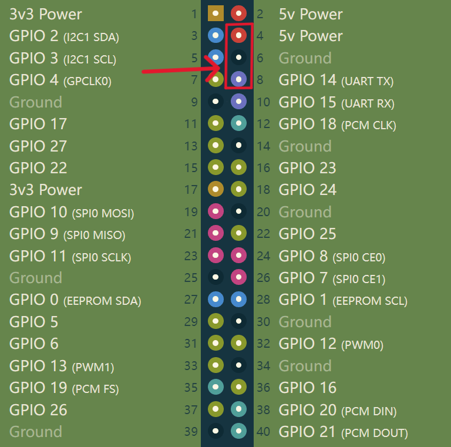

# 图传食用指南-第二版 #
基本逻辑是opencv结合socket传输（tcp），树莓派用opencv-python，地面站用opencv-c++，传输的图像为Mat类，坐标以**字符串**传输

+ ## 地面站准备工作 ## 
1. 去 <https://github.com/zznlzz/dxy>  上下载最新的源码，里面也写了一个一个`README.md`文件写了所需环境和每个文件夹代码的作用，最终的图传使用的是文件夹`transfer-c++`里面的内容。
2. 打开`transfer-c++/transfer.cpp`, 修改
   ```
   第58行  server_addr.sin_addr.s_addr = inet_addr("树莓派ip");
   ```
3. 进入`transfer-c++/build`， 删除此文件夹中所有文件，在**终端**中打开，输入
    ```bash
    cmake ..
    make
    ```
+ ***tips***: *若改动 `CmakeLists.txt`,需要删除makefiles重新cmake, 而若只改动代码内容只需重新cmake*
---
+ ## 树莓派准备工作 ## 
1. 舵机接线

---
+ ## 正式使用 ##
+ ***天空端***
   ```bash
   cd test
   sudo pigpiod
   sudo python3 transfer.py
   ```
+ ***地面站***
1. 进入`transfer-c++/build`
    ```bash
    ./main
    ```
2. 关闭图传
   选中显示出的图像窗口按`q`退出，树莓派代码也会自动退出
+ ***tips***: *尽量不要在树莓派上ctrl+z强制退出，进程会被占用，下次使用就会报错，这时推荐重启树莓派重新运行程序 ~~实在要在树莓派上退出用ctrl+c~~*  